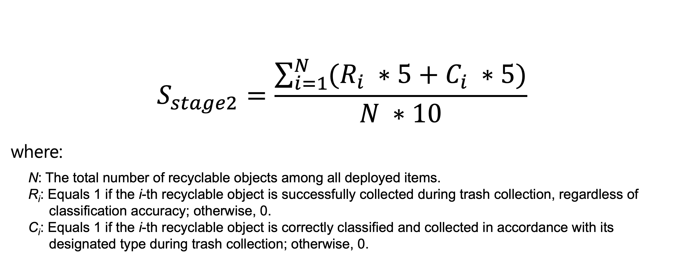

# Getting Started Guide

## Introduction

Welcome to the MetaSejong AI Robotics Challenge 2025! This competition is a side event of IEEE MetaCom 2025 and is part of the MetaCom 2025 Student Challenge Programs. It provides an innovative platform that combines metaverse and AI robotics technologies.

The MetaSejong AI Robotics Challenge takes place in a metaverse space modeled after Sejong University. Participating teams will solve given challenges using Embodied AI technology in this virtual environment. Participants will control robots and perform missions by applying various AI technologies in the virtual Sejong University campus.

This guide provides a comprehensive walkthrough from development environment setup to mission execution. It explains in detail how to interact with the virtual environment through ROS2 standard interfaces, helping participants prepare smoothly for the competition.

## System Architecture


The competition system consists of the following main components:

1. **MetaSejong Platform**
The MetaSejong Platform is a metaverse virtual environment of Sejong University built on NVIDIA IsaacSim. It provides the following key features:

    - Real-time 3D virtual environment simulation
    - Physics engine-based precise robot motion simulation
    - Various sensor data streaming
    - Real-time robot control interface

2. **Participant Development Environment**
    - ROS2-based application development environment
    - AI algorithm implementation and testing environment
    - Docker container-based independent development space

3. **Communication Interface**
The APIs required for participants to perform missions are provided through ROS2 interfaces. Detailed API documentation is available in a separate document, including the following main features:

    - Robot control interface
    - Sensor data collection
    - Environment information access
    - Mission progress monitoring

The MetaSejong Platform serves as a learning environment for the AI Robotics applications developed by participants. This allows testing and optimization of various scenarios without using actual robots.

## Prerequisites

To participate in the MetaSejong AI Robotics Challenge 2025, the following requirements must be met. Each requirement is essential for competition participation and development:

### 1. Hardware Requirements

#### MetaSejong Platform Execution Environment
- **CPU**: Intel Core i7-8700K or AMD Ryzen 7 3700X or higher
- **RAM**: 32GB or more
- **GPU**: NVIDIA RTX 3080 or NVIDIA RTX A5000 or higher
  - CUDA 11.7 or higher support
  - Minimum 8GB VRAM
- **Storage**: SSD with 100GB or more free space
- **Network**: 1Gbps or higher network connection

#### Participant Development Environment
- **CPU**: Intel Core i5 or AMD Ryzen 5 or higher
- **RAM**: 8GB or more
- **GPU**: NVIDIA GPU (optional, recommended for AI algorithm implementation)
- **Storage**: 20GB or more free space
- **Network**: 100Mbps or higher network connection

### 2. Software Requirements

#### MetaSejong Platform
- **Operating System**: Ubuntu 22.04 LTS
- **Python**: 3.10 or higher
- **Docker**: 20.10 or higher
- **Docker Compose**: 2.0 or higher
- **NVIDIA Driver**: 525.60.13 or higher
- **CUDA**: 11.7 or higher

#### Participant Development Environment
- **Operating System**: Ubuntu 22.04 LTS
- **Python**: 3.10 or higher
- **ROS2**: Humble Hawksbill
- **Docker**: 20.10 or higher
- **Docker Compose**: 2.0 or higher

### 3. Development Tools and Knowledge Requirements

#### Essential Development Tools
- **Git**: Version control and collaboration
- **Docker**: Container-based development environment management
- **ROS2**: Robot control system development
- **Python IDE**: Code writing and debugging

#### Essential Knowledge
- **Python Programming**: Algorithm implementation and debugging
- **ROS2 Basic Concepts**: Topics, services, actions, etc.
- **Docker Basic Usage**: Image building and container execution
- **Basic AI/ML Knowledge**: Object detection, pose estimation, etc.

### 4. Competition Participation Requirements

#### Required Information
- **Team Information**: Team name, team member information
- **Application Form**: Form provided by the competition organizers
- **Team ID**: Issued after application approval
- **Authentication Token**: Issued after application approval

#### Submission Requirements
- **GitHub Repository**: Private repository recommended
- **Code Submission**: Final code in main/master branch
- **Documentation**: HOWTORUN.md file included
- **Execution Method**: Must be executable with make up-prod command

## Installation Method

### 1. MetaSejong Platform Installation

#### 1.1 System Prerequisites Setup

The MetaSejong Platform is an IsaacSim simulation application distributed via Docker that includes a GUI. To run GUI applications in Docker, X11 settings are required.

1. **X11 Settings Check**
   ```bash
   # Check X11 settings
   echo $DISPLAY
   ```
   - Output should be in the format `:1` or `localhost:1`
   - If X11 is not set up, refer to [Ubuntu X Architecture](https://wiki.ubuntu.com/X/Architecture) for setup instructions

#### 1.2 Competition Repository Cloning

1. **Repository Cloning**
   ```bash
   # Clone MetaSejong Platform repository
   git clone https://github.com/metasejong-competition/metacom2025-metasejong
   cd metacom2025-metasejong
   ```

2. **Repository Structure**
   - `docker-compose.yml`: Environment configuration settings file
   - `Makefile`: Build and execution commands
   - Example code and documentation

#### 1.3 Docker Image Download

1. **Image Download**
   ```bash
   # Download via Makefile
   make download
   ```
   - Or direct download: [metasejong-metacom2025-r02.tar](https://drive.google.com/file/d/10r-tzDj0qS6OKWEle0gl4GnRtEitVKD5/view?usp=sharing)
   - Do not change the downloaded filename

2. **Docker Image Load**
   ```bash
   # Load downloaded image
   make load
   ```

#### 1.4 Platform Execution

1. **X11 Activation**
   ```bash
   # Activate X11 (run only once)
   make setup
   ```

2. **Platform Execution**
   ```bash
   # Run MetaSejong Platform
   make run
   ```
   - Note that there may be performance limitations during execution

### 2. Participant Development Environment Setup

#### 2.1 Preparation

1. **Application**
   - Submit application at [Application Submission](https://metasejong-competition.github.io/)
   - Team ID and authentication token issued after application review
   - Team information received via email with confirmation message

#### 2.2 Development Environment Repository Setup

1. **Repository Fork**
   - Fork [Development Environment Repository](https://github.com/metasejong-competition/metasejong-airobotics)
   - Private repository recommended

2. **Repository Cloning**
   ```bash
   # Clone development environment repository
   git clone https://github.com/<your_team_account>/metasejong-airobotics
   cd metasejong-airobotics
   ```

#### 2.3 Environment Variable Setup

1. **Required Environment Variables**
   ```bash
   # Set environment variables
   export ENV_METASEJONG_TEAM_NAME="your_team_name"
   export ENV_METASEJONG_TEAM_TOKEN="your_team_token"
   export ENV_METASEJONG_TEAM_TARGET_LEVEL="your_target_level"

   # Set permanent environment variables (optional)
   echo "export ENV_METASEJONG_TEAM_NAME=\"your_team_name\"" >> ~/.bashrc
   ```

2. **Demo Environment Variable Values**
   |Environment Variable|Value|
   |---|---|
   |ENV_METASEJONG_TEAM_NAME|team_passion_for_challenges|
   |ENV_METASEJONG_TEAM_TOKEN|87cef2059293b764451516c5e632e8b5|
   |ENV_METASEJONG_TEAM_TARGET_LEVEL|2|

#### 2.4 Build and Execution

1. **Build Commands**
   ```bash
   # Build development image
   make build-dev
   
   # Build production image
   make build-prod
   ```

2. **Execution Commands**
   ```bash
   # Run development environment
   make up-dev
   
   # Run production environment
   make up-prod
   
   # Stop container
   make down
   
   # Clean Docker resources
   make clean
   ```

### 3. Result Submission

#### 3.1 Submission Preparation

1. **Code Organization**
   - Push final code to main/master branch
   - Document execution method (HOWTORUN.md)

2. **Repository Sharing**
   - Add organizer's GitHub account as collaborator
   - Verify private repository settings

#### 3.2 Submission Requirements

1. **Required Files**
   - Modified Makefile
   - Modified Dockerfile
   - Modified docker-compose.yml
   - HOWTORUN.md (if needed)

2. **Execution Method**
   - Must be executable with `make up-prod` command
   - Document any special settings in detail

## Demo Application

### 1. Demo Application Structure

The demo application is provided with the following structure:

```
.
|   # Project guide document
├── README.md       
|   # Docker related files
├── Dockerfile      
├── Dockerfile.dev
├── docker-compose.yaml
├── entrypoint.sh
|   # Commands for development, score calculation, etc.
├── Makefile
|   # Participant application workspace (ROS2 Workspace)
└── metasejong_competitor_ws
    └── src
        |   
        └── airobotics_app
            |   # ROS2 package definition and module dependencies
            ├── package.xml
            ├── requirements.txt
            |   # Participant ROS Node implementation
            ├── airobotics_node
            │   ├── __init__.py
            |   |   # ROS Node execution entry point
            │   ├── airobotics_node.py
            |   |   # Basic competition participant application template example implementation (abstract implementation)
            │   ├── competition_task_base.py
            |   |   # Basic competition participant application template example implementation
            │   ├── competition_task_implementation.py
            │   ├── competitor_request_message.py
            |   |   # Utility function example implementation
            │   ├── robot_node.py
            │   ├── robot_util.py
            │   └── world_coordinates_util.py
            ├── resource
            │   ├── airobotics_app
            │   └── metasejong
            ├── setup.cfg
            └── setup.py
```

### 2. Demo Application Workflow


The demo application workflow is as follows:

1. **Participant Application Start Request**
   - Send COMPETITOR_APP_STARTED request
   - Include team ID, authentication token, supported stage
   - stage 1: object detection and pose estimation
   - stage 2: object collection and classification

2. **Participant Work Preparation Phase**
   - Platform validates team ID and authentication token
   - Competition environment configuration
   - Virtual environment data streaming starts
   - Data provision through ROS Topic begins

3. **Start Response Reception**
   - Receive COMPETITOR_APP_STARTED_RESPONSE
   - Confirm all preparations complete
   - Begin main competition work

4. **Stage 1 Work**
   - Analyze fixed camera images
   - Object detection and pose estimation
   - Determine trash object positions and orientations

5. **Stage 1 Result Report and Evaluation**
   - Send REPORT_STAGE1_RESULT request
   - Platform responds with evaluation results
   - Analysis data format:
   ```json
   {
       "msg": 102,
       "session": <session id>,
       "payload": {
           "object_detections": [
               {"class_name": "master_shelf_can", "position": [x, y, z]},
               ... 
           ]
       }
   }
   ```

6. **Stage 2 Work**
   - Perform actual work using robot
   - Robot movement and robot arm control
   - Trash collection and classification

7. **Robot Control Interface**
   - `/metasejong2025/odom`: Robot position information
   - `/metasejong2025/tf`: Coordinate transformation information
   - `/metasejong2025/cmd_vel`: Robot movement commands
   - `/metasejong2025/ppcmd`: Robot arm control commands

8. **Stage 2 Work Evaluation**
   - Real-time work performance evaluation
   - Collection success and classification success evaluation
   - Final score calculation:
   

## Next Steps

- Read the [Technical Guide](technical-guide.md): You can check detailed technical information.
- Review the [Competition Rules](rules.md): You can check the essential rules for competition participation.
- Check the [Submission Guide](submit-guide.md): You can check the guide for result submission methods.