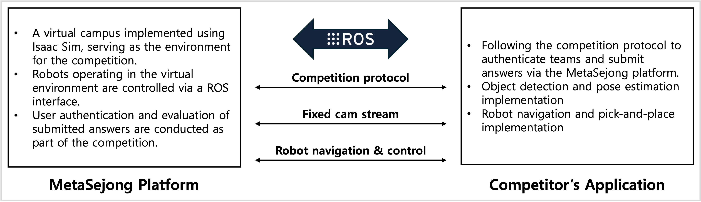
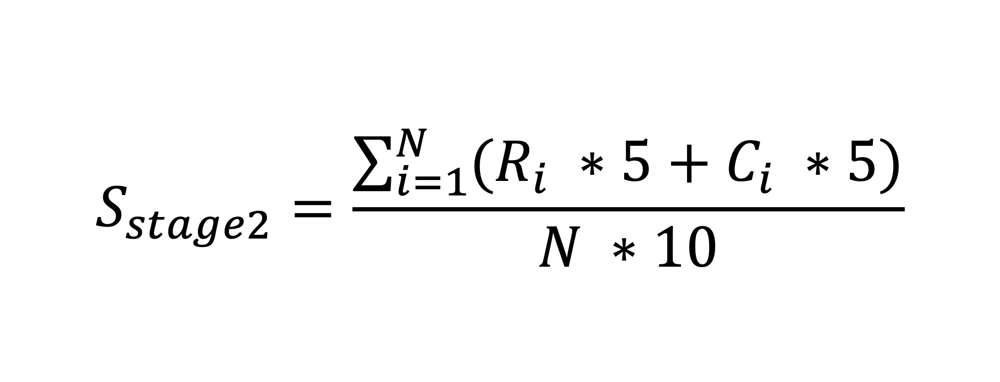

# Getting Started Guide

## Introduction

MARC (Meta-Sejong AI Robotics Challenge) 2025에 오신 것을 환영합니다! 본 대회는 IEEE MetaCom 2025의 부대행사이며, MetaCom 2025 Student Challenge Programs의 일환으로 진행됩니다. 메타버스와 AI 로보틱스 기술을 융합한 혁신적인 도전의 장을 제공합니다.

MARC (Meta-Sejong AI Robotics Challenge) 2025는 세종대학교를 모델로 한 메타버스 공간에서 진행됩니다. 참가 팀들은 이 가상 환경에서 Embodied AI 기술을 활용하여 주어진 과제를 해결하게 됩니다. 참가자들은 가상의 세종대학교 캠퍼스에서 로봇을 제어하고, 다양한 AI 기술을 적용하여 미션을 수행하게 됩니다.

본 가이드는 개발 환경 구성부터 미션 수행까지의 전체 과정을 안내합니다. ROS2 표준 인터페이스를 통해 가상 환경과 상호작용하는 방법을 단계별로 상세히 설명하여, 참가자들이 원활하게 대회를 준비할 수 있도록 도와드립니다.

## System Architecture



   대회 시스템은 다음과 같은 주요 구성 요소로 이루어져 있습니다:

   1. **Meta-Sejong Platform**

   Meta-Sejong 플랫폼은 NVIDIA IsaacSim을 기반으로 구축된 세종대학교의 메타버스 가상 환경입니다. 다음과 같은 주요 기능을 제공합니다:

      - 실시간 3D 가상 환경 시뮬레이션
      - 물리 엔진 기반의 정밀한 로봇 동작 시뮬레이션
      - 다양한 센서 데이터 스트리밍
      - 실시간 로봇 제어 인터페이스

      <br/>

   2. **Competitor's Application**

   MARC 2025 참가자팀이 개발해야 하는 어플리케이션입니다. 주최측에서는 다음과 같은 개발 환경을 제공합니다.

      - ROS2 기반의 애플리케이션 개발 환경
      - AI 알고리즘 구현 및 테스트 환경
      - Docker 컨테이너 기반의 독립적인 개발 공간

      <br/>

   3. **ROS2 Interface**

   대회 참가자들이 미션을 수행하는 데 필요한 API는 ROS2 인터페이스를 통해 제공됩니다. API에 대한 자세한 설명은 별도의 문서에서 확인할 수 있으며, 다음과 같은 주요 기능을 포함합니다:

      - 로봇 제어 인터페이스
      - 센서 데이터 수집
      - 환경 정보 접근
      - 미션 진행 상태 모니터링

   Meta-Sejong 플랫폼은 참가자들이 개발하는 AI Robotics 애플리케이션의 학습 환경으로 활용됩니다. 이를 통해 실제 로봇을 사용하지 않고도 다양한 시나리오를 테스트하고 최적화할 수 있습니다.


## Prerequisites

   MARC (Meta-Sejong AI Robotics Challenge) 2025에 참가하기 위해서는 다음과 같은 요구사항을 충족해야 합니다. 각 요구사항은 대회 참가와 개발에 필수적인 요소들입니다:
   대회 참가를 위한 필수 요구사항에 대한 상세한 내용은 [기술 가이드](technical-guide.md)를 참고하세요.

   ### 1. Hardware Requirements

#### Meta-Sejong 플랫폼 실행 환경
- **CPU**: Intel Core i7-8700K 또는 AMD Ryzen 7 3700X 이상
- **RAM**: 32GB 이상
- **GPU**: NVIDIA RTX 3080 또는 NVIDIA RTX A5000 이상
  - CUDA 11.7 이상 지원
  - 최소 8GB VRAM
- **저장공간**: SSD 100GB 이상의 여유 공간
- **네트워크**: 1Gbps 이상의 네트워크 연결

#### 참가자 개발 환경
- **CPU**: Intel Core i5 또는 AMD Ryzen 5 이상
- **RAM**: 8GB 이상
- **GPU**: NVIDIA GPU (선택 사항, AI 알고리즘 구현 시 권장)
- **저장공간**: 20GB 이상의 여유 공간
- **네트워크**: 100Mbps 이상의 네트워크 연결

### 2. Software Requirements

#### Meta-Sejong 플랫폼
- **운영체제**: Ubuntu 22.04 LTS
- **Python**: 3.10 이상
- **Docker**: 20.10 이상
- **Docker Compose**: 2.0 이상
- **NVIDIA 드라이버**: 525.60.13 이상
- **CUDA**: 11.7 이상

#### 참가자 개발 환경
- **운영체제**: Ubuntu 22.04 LTS
- **Python**: 3.10 이상
- **ROS2**: Humble Hawksbill
- **Docker**: 20.10 이상
- **Docker Compose**: 2.0 이상

### 3. 개발 도구 및 지식 요구사항

#### 필수 개발 도구
- **Git**: 버전 관리 및 협업
- **Docker**: 컨테이너 기반 개발 환경 관리
- **ROS2**: 로봇 제어 시스템 개발
- **Python IDE**: 코드 작성 및 디버깅

#### 필수 지식
- **Python 프로그래밍**: 알고리즘 구현 및 디버깅
- **ROS2 기본 개념**: 토픽, 서비스, 액션 등
- **Docker 기본 사용법**: 이미지 빌드 및 컨테이너 실행
- **기본적인 AI/ML 지식**: 객체 감지, 포즈 추정 등

### 4. Competition Participation Requirements

#### 필수 정보
- **팀 정보**: 팀명, 팀원 정보
- **참가 신청서**: 대회 주최측에서 제공하는 양식 작성
- **팀 ID**: 참가 신청 승인 후 발급
- **인증 토큰**: 참가 신청 승인 후 발급

#### 제출 요구사항
- **GitHub 저장소**: 비공개 저장소 권장
- **코드 제출**: main/master 브랜치에 최종 코드
- **문서화**: HOWTORUN.md 파일 포함
- **실행 방법**: make up-prod 명령으로 실행 가능

## Installation Guide

### 1. Meta-Sejong Platform Installation

#### 1.1 System Prerequisites Setup

Meta-Sejong 플랫폼은 Docker로 배포되는 IsaacSim 시뮬레이션 응용프로그램으로, GUI를 포함하고 있습니다. GUI 애플리케이션을 Docker에서 실행하기 위해서는 X11 설정이 필요합니다.

1. **X11 Setup Verification**
   ```bash
   # X11 설정 확인
   echo $DISPLAY
   ```
   - 출력이 `:1` 또는 `localhost:1` 형식이어야 합니다.
   - X11 설정이 되어있지 않은 경우, [Ubuntu X Architecture](https://wiki.ubuntu.com/X/Architecture)를 참고하여 설정하세요.

#### 1.2 Competition Repository Clone

1. **Repository Clone**
   ```bash
   # Meta-Sejong 플랫폼 저장소 복제
   git clone https://github.com/metasejong-competition/metacom2025-metasejong
   cd metacom2025-metasejong
   ```

2. **Repository Structure**
   - `docker-compose.yml`: 환경 구성 설정 파일
   - `Makefile`: 빌드 및 실행 명령어
   - 예제 코드 및 문서

#### 1.3 Docker Image Download

1. **Image Download**
   ```bash
   # Makefile을 통한 다운로드
   make download
   ```
   - 또는 직접 다운로드: [metasejong-metacom2025-with-playground-r06.tar](https://drive.google.com/file/d/1fWGCelUpPuHxYX9ECWaa8SxL5NXOrL72/view?usp=drive_link)
   - 다운로드 받은 파일명은 변경하지 마세요.

2. **Docker Image Load**
   ```bash
   # 다운로드 받은 이미지 로드
   make load
   ```

#### 1.4 Platform Execution

1. **X11 Activation**
   ```bash
   # X11 활성화 (한 번만 실행)
   make setup
   ```

2. **Platform Execution**
   ```bash
   # Meta-Sejong 플랫폼 실행
   make run
   ```
   - 실행 시 성능 제한이 있을 수 있으니 참고하세요.

### 2. Participant Development Environment Setup

#### 2.1 Preparation

1. **Application**
   - [신청서 제출](https://metasejong-competition.github.io/)에서 참가 신청
   - 신청서 검토 후 팀 ID와 인증 토큰 발급
   - 이메일로 확인 메시지와 함께 팀 정보 수신

#### 2.2 Development Environment Repository Setup

1. **Repository Fork**
   - [개발환경 리포지토리](https://github.com/metasejong-competition/metasejong-airobotics)를 Fork
   - 비공개 저장소로 설정 권장

2. **Repository Clone**
   ```bash
   # 개발 환경 저장소 복제
   git clone https://github.com/<your_team_account>/metasejong-airobotics
   cd metasejong-airobotics
   ```

#### 2.3 Environment Variable Setup

1. **Required Environment Variables**
   ```bash
   # 환경 변수 설정
   export ENV_METASEJONG_TEAM_NAME="your_team_name"
   export ENV_METASEJONG_TEAM_TOKEN="your_team_token"
   export ENV_METASEJONG_TEAM_TARGET_STAGE="your_target_stage"

   # 영구적인 환경 변수 설정 (선택)
   echo "export ENV_METASEJONG_TEAM_NAME=\"your_team_name\"" >> ~/.bashrc
   ```

2. **Demo Environment Variable Values**
   |환경변수|값|
   |---|---|
   |ENV_METASEJONG_TEAM_NAME|demo_team|
   |ENV_METASEJONG_TEAM_TOKEN|18471a11421511d3c3a9f56c53bc8d57|
   |ENV_METASEJONG_TEAM_TARGET_STAGE|2|

#### 2.4 Execution

1. **Execution Command**
   ```bash
   make run
   ```

### 3. Submission

#### 3.1 Submission Preparation

1. **Code Organization**
   - main 또는 master 브랜치에 최종 코드 push
   - 실행 방법 문서화 (HOWTORUN.md)

2. **Repository Sharing**
   - 주최측 GitHub 계정을 collaborator로 등록
   - 비공개 저장소 설정 확인

#### 3.2 Submission Requirements

1. **Required Files**
   - 수정된 Makefile
   - 수정된 Dockerfile
   - 수정된 docker-compose.yml
   - HOWTORUN.md (필요한 경우)

2. **Execution Method**
   - `make run` 명령으로 실행 가능해야 함
   - 특수한 설정이 필요한 경우 상세히 문서화

## Demo Application

데모 애플리케이션의 상세한 구조와 개발 가이드는 [기술 가이드](technical-guide.md)를 참고하세요.

### 1. Demo Application Execution

데모 애플리케이션은 로컬 컴퓨터에서 동작하는 Meta-Sejong 플랫폼에서 데모와 학습을 위해 생성되는 정답지를 활용하여 동작합니다. 정답지는 Meta-Sejong 플랫폼에서 경연 시나리오 정의에 따라 랜덤하게 생성되는 쓰레기들의 유형과 위치 정보를 제공합니다. 데모 애플리케이션은 참가자가 개발하여야 하는 객체 인식 기술 및 포즈 추정 기술 구현을 mockup 형태로 구현하였으며, mockup 구현에서 정답지를 활용하여 경연 프로토콜 구현 및 로봇 제어에 활용합니다.

#### 1.1 Answer Sheet File Connection
- **정답지 파일 경로**: `<Meta-Sejong 플랫폼 실행 경로>/scenario-data/answer-sheets/<scenario name>_answer_sheet.yaml`
- **데모 애플리케이션 정답지 위치**: `<개발환경 프로젝트>/demo/demo_answer_sheet.yaml`
- **주의사항**: 정답지는 Meta-Sejong 플랫폼을 실행하는 시점에 매번 새롭게 생성되므로, 파일을 복사하기보다는 심볼릭 링크를 설정하는 것을 권장합니다.

#### 1.2 Team Information Environment Setup
경연 프로토콜에 따라 참가자 애플리케이션은 팀 ID와 인증 토큰, 지원하는 Stage 정보를 Meta-Sejong 플랫폼에 제시해야 합니다. 이러한 정보는 환경변수로 설정되어야 합니다.

```yaml
environment:
  - ...
  - ENV_METASEJONG_TEAM_NAME=team_passion_for_challenges
  - ENV_METASEJONG_TEAM_TOKEN=87cef2059293b764451516c5e632e8b5
  - ENV_METASEJONG_TEAM_TARGET_STAGE=2
```

**주의**: 경연 결과물을 제출할 때는 반드시 이 정보를 참가 신청 과정에서 발급받은 값으로 수정하여 제출해야 합니다.

### 2. Demo Application Operation Flow


위 그림은 데모 애플리케이션의 전체 동작 흐름을 보여줍니다. 주요 단계별 설명은 다음과 같습니다:

1. **Participant Application Start Request**
   - COMPETITOR_APP_STARTED 요청 전송
   - team ID, authentication token, 지원 stage 포함
   - stage 1: 객체 감지 및 포즈 추정
   - stage 2: 객체 수집 및 분류

2. **Participant Work Preparation Phase**
   - 플랫폼에서 team ID와 인증 토큰 검증
   - 대회 환경 구성
   - 가상 환경 데이터 스트리밍 시작
   - ROS Topic으로 데이터 제공 시작

3. **Start Response Reception**
   - COMPETITOR_APP_STARTED_RESPONSE 응답 수신
   - 모든 준비 완료 확인
   - 본격적인 대회 작업 시작

4. **Stage 1 Work**
   - 고정 카메라 이미지 분석
   - 객체 감지 및 포즈 추정
   - 쓰레기 물체 위치 및 방향 파악

5. **Stage 1 Result Report and Evaluation**
   - REPORT_STAGE1_RESULT 요청 전송
   - 플랫폼에서 평가 결과 회신
   - 분석 데이터 포맷:
   ```json
   {
       "msg": 102,
       "session": <session id>,
       "payload": {
           "object_detections": [
               {"class_name": "master_shelf_can", "position": [x, y, z]},
               ... 
           ]
       }
   }
   ```
    - 점수 계산: 
        Stage 1의 점수는 Meta-Sejong Platform에 저장된 정답지와 참가자가 제출한 Stage 1 result의 'object_detections' 항목을 비교하여 정확하게 인식된 객체의 갯수가 평가의 지표가 됩니다.

6. **Stage 2 Work**
   - 로봇을 이용한 실제 작업 수행
   - 로봇 이동 및 로봇팔 제어
   - 쓰레기 수집 및 분류

7. **Robot Control Interface**
   - Robot control command
      - `/metasejong2025/robot/cmd_vel`: 로봇 이동 명령
      - `/metasejong2025/robot/ppcmd`: 로봇팔 제어 명령

   - Robot position information
      - `/metasejong2025/robot/odom`: 로봇 위치 정보
      - `/tf`: 좌표 변환 정보

   - Map information
      - `/metasejong2025/map`: Global 지도


8. **Stage 2 Work Evaluation**
   - 실시간 작업 수행 평가
   - 수집 성공 여부 및 분류 성공 여부 평가
   - 점수 계산:
   

각 단계별 상세한 구현 방법과 API 사용법은 [기술 가이드](technical-guide.md)를 참고하세요.

## Next Steps

- [기술 가이드](technical-guide.md)를 읽어보세요: 상세한 기술 정보를 확인할 수 있습니다.
- [제출 가이드](submit-guide.md)를 확인하세요: 결과물 제출 방법에 대한 안내를 확인할 수 있습니다.

